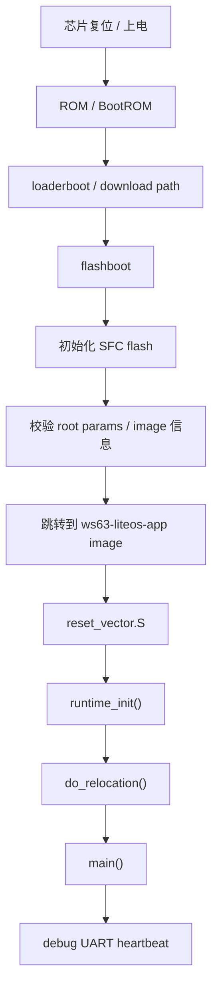

# WS63E Minimal Driver SDK: Build To Runtime Architecture

本文档描述当前工作区被裁剪后的 SDK 形态、构建产物、烧录链路，以及从芯片复位到应用入口运行的启动流程。

## 1. 当前 SDK 定位

当前 SDK 的目标不是继续运行厂商 demo，而是作为一个干净的驱动/协议栈底座：

- 保留芯片启动链、LiteOS、驱动层、无线协议栈、NV/分区/升级等基础能力。
- 删除应用层 demo、samples、vendor 示例工程，避免以后写业务时被示例代码干扰。
- 保留原始构建目标名 `ws63-liteos-app`，因为部分闭源库和补丁库按该目标名组织路径。
- 将 `ws63-liteos-app` 目标实际链接到新的最小应用组件 `ws63_liteos_min_app`。

核心思路是：

```text
厂商完整 SDK
  -> 删除 demo/sample/vendor 示例
  -> 保留 drivers/protocol/middleware/kernel/boot
  -> 用最小 APP 验证启动链路
  -> 后续在最小 APP 上写自己的业务
```

## 2. 已经做过的主要裁剪行为

### 2.1 删除应用示例层

删除或解除构建引用的主要内容：

- `src/application/samples`
- `src/application/ws63/ws63_liteos_application`
- `src/application/ws63/ws63_liteos_mfg`
- `vendor/*/demo`
- `vendor/*/peripheral`
- `vendor/*/products`
- `vendor/build_sample.py`

这些目录本质是应用示例、教学 demo、厂商板级 demo，不属于你要保留的驱动层。

### 2.2 新增最小应用入口

当前自定义应用入口：

```text
src/application/ws63/ws63_minimal_application
```

组件名：

```text
ws63_liteos_min_app
```

主要文件：

- `main.c`: 当前最小启动和串口心跳入口
- `reset_vector.S`: RISC-V 复位入口
- `clock_init.c/.h`: ASIC 时钟和 RF/UART 时钟初始化辅助
- `CMakeLists.txt`: 定义 `ws63_liteos_min_app`

### 2.3 保留的底层能力

当前 `ws63-liteos-app` 仍保留大量底层组件，包括：

- 外设驱动：UART、GPIO、I2C、SPI、DMA、PWM、ADC、SFC、EFUSE、watchdog、timer、systick、TCXO、PMP、SIO/I2S。
- 系统基础：LiteOS、OSAL、分区、NV、update、factory、DFX 基础组件。
- 无线协议栈：Wi-Fi、BT host/controller、BLE、SLE/GLE、BG common、BGTP、BTH SDK、CHBA/SLE netdev。
- 网络和安全：lwIP、mbedTLS、CoAP、MQTT、security unified。
- TIOT transport：保留给外部通信/模组适配层使用。

也就是说，示例应用删掉了，但驱动和协议栈并没有被删。

## 3. 关键配置变化

### 3.1 构建目标仍然叫 `ws63-liteos-app`

文件：

```text
src/build/config/target_config/ws63/config.py
```

关键变化：

```text
ram_component:
  ws63_liteos_app     -> ws63_liteos_min_app
  samples             -> removed
```

保留 `ws63-liteos-app` 名称的原因：

- SDK 的闭源补丁库、ROM patch、部分中间产物路径依赖原目标名。
- 改成新目标名会导致类似 `libplat_patch.a` 找不到。
- 因此目标名不改，只替换应用组件。

### 3.2 关闭二进制日志源

为了避免串口出现 HSO/DFX 二进制乱码，应用目标关闭：

- `hso_enable`
- `hso_enable_bt`
- HSO binary log
- DFX print output
- DFX binary exception memory dump
- dynamic UART binding

同时将以下目标的 log/debug 串口统一为 UART0/115200：

- `ws63-liteos-app`
- `ws63-flashboot`
- `ws63-loaderboot`

这样启动、boot、app 心跳都使用同一个串口参数：

```text
UART0
115200
8N1
```

### 3.3 Flash 兼容处理

启动日志里的：

```text
Flash Init Fail! ret = 0x80001341
```

对应：

```text
ERRCODE_SFC_FLASH_NOT_SUPPORT
```

这个值表示 SFC 驱动没有匹配到当前 flash ID。当前处理思路是：

- 未识别 flash 时使用默认 flash 描述。
- 默认 unknown flash 容量改为 8MB，避免 512KB 默认值无法覆盖 SDK 分区地址。
- boot 初始化中将 `ERRCODE_SFC_FLASH_NOT_SUPPORT` 视为可继续运行的 fallback 状态。

新 boot 镜像里应看到类似：

```text
Flash Init Default! ret = 0x80001341
```

如果仍然看到 `Flash Init Fail!`，说明板上运行的 boot 镜像不是当前新编出来的完整包。

## 4. 编译到产物的流程

DevEco/HiSpark 调用大致流程：

```text
hos run --target clean --target buildprog --project-dir src --environment WS63
```

构建入口最终会调用：

```text
python build.py ws63-liteos-app
```

构建系统处理过程：

```text
ws63.json / deveco_config.json
  -> 选择 custom_build_command: ws63-liteos-app
  -> build.py 读取 target_config/ws63/config.py
  -> Kconfig 生成 mconfig.h / menuconfig.h
  -> CMake 生成 Ninja 工程
  -> 编译 boot 和 app 组件
  -> 链接 ELF/BIN
  -> 签名
  -> 复制中间文件
  -> 打包 fwpkg
```

主要输出路径：

```text
src/output/ws63/acore/ws63-liteos-app/ws63-liteos-app.elf
src/output/ws63/acore/ws63-liteos-app/ws63-liteos-app.bin
src/output/ws63/acore/ws63-liteos-app/ws63-liteos-app-sign.bin
src/output/ws63/fwpkg/ws63-liteos-app/ws63-liteos-app_all.fwpkg
```

烧录使用完整包：

```text
src/output/ws63/fwpkg/ws63-liteos-app/ws63-liteos-app_all.fwpkg
```

不要只烧 app-only 包。当前修改涉及 boot、串口配置、app，建议烧完整 all 包。

## 5. 烧录流程

DevEco/BurnTool 设置：

```text
target/chip: WS63
protocol: burn-serial
upload baud: 921600
package: ws63-liteos-app_all.fwpkg
```

烧录时串口是下载协议通道，使用 921600 是正常的。

烧录完成后，关闭烧录连接，再打开串口监视器：

```text
baud: 115200
data: 8
parity: N
stop: 1
```

注意区分：

- 烧录速度：921600
- 运行日志速度：115200

## 6. 从复位到应用运行的启动链路

整体链路：



### 6.1 Boot 阶段

boot 阶段负责：

- 初始化 flash 访问。
- 读取分区和镜像信息。
- 执行安全校验流程。
- 将控制权交给应用镜像。

常见日志：

```text
boot.
Flash Init Default! ret = 0x80001341
verify_public_rootkey secure verify disable!
verify_params_key_area secure verify disable!
verify_params_area_info secure verify disable!
verify_image_key_area secure verify disable!
verify_image_code_info secure verify disable!
```

这些 `secure verify disable` 表示当前安全校验未启用，不是应用异常。

### 6.2 `reset_vector.S`

应用镜像入口是：

```text
src/application/ws63/ws63_minimal_application/reset_vector.S
```

主要动作：

- 设置 trap vector：`mtvec = TrapVector`
- 清理中断状态：`mstatus = 0`, `mie = 0`
- 初始化 FPU 状态
- 初始化全局指针 `gp`
- 设置启动栈 `sp = __stack_top__`
- 用固定值填充系统栈，方便调试栈使用情况
- 跳转到 `runtime_init`

### 6.3 `runtime_init()`

文件：

```text
src/application/ws63/ws63_minimal_application/main.c
```

流程：

```text
runtime_init()
  -> dyn_mem_cfg()
  -> do_relocation()
  -> main()
```

`do_relocation()` 负责把链接脚本定义的段搬到正确 RAM 区域：

- ROM data
- ROM patch
- TCM text
- TCM data
- SRAM text
- data
- bss 清零

这些符号来自：

```text
src/drivers/boards/ws63/evb/memory_config/include/share_mem_config.h
```

### 6.4 当前 `main()` 流程

当前 `main()` 是最小心跳验证入口：

```text
main()
  -> patch_init()
  -> uapi_partition_init()
  -> pmp_enable()
  -> cpu_cache_init()
  -> LOS_PrepareMainTask()
  -> osKernelInitialize()
  -> minimal_hw_init()
  -> minimal_watchdog_stop()
  -> while(1) print APP|hello
```

`minimal_hw_init()` 负责：

- ASIC 下设置 UART/TCXO 时钟周期。
- 打开 RF power。
- 切换系统时钟。
- bypass UART auto gate，避免 UART 时钟被自动门控。
- 初始化 pinctrl 和 GPIO。
- 初始化 debug UART。
- 初始化 timer、systick、TCXO。

当前串口期望输出：

```text
APP|dbg uart init ok.
APP|minimal heartbeat init ok.
APP|watchdog disabled.
APP|kernel initialize state=...
APP|main heartbeat start.
APP|hello
APP|hello
```

## 7. 当前 OS 状态说明

当前版本调用了：

```c
LOS_PrepareMainTask();
osKernelInitialize();
```

也就是说 LiteOS 内核已经完成初始化准备，但当前最小心跳版本没有调用：

```c
osKernelStart();
```

这是刻意设计的第一阶段验证：

- 先确认 boot -> app 跳转正常。
- 先确认 debug UART 可持续打印。
- 先确认不会 watchdog 自动复位。
- 先确认不再输出 HSO/DFX 二进制乱码。

后续你写自己的业务时，可以在这个基础上进入第二阶段：

```text
创建自己的任务
  -> osThreadNew / osal_kthread_create
  -> osKernelStart()
  -> 业务任务中初始化需要的 BLE/SLE/Wi-Fi/外设
```

## 8. 后续写应用的建议入口

建议把你的应用逻辑逐步放到：

```text
src/application/ws63/ws63_minimal_application
```

推荐演进顺序：

1. 保留当前 `APP|hello` 心跳，确认每次烧录后启动稳定。
2. 增加一个最小用户任务，例如 `user_task`。
3. 调用 `osThreadNew()` 创建任务。
4. 最后调用 `osKernelStart()` 启动 LiteOS 调度器。
5. 在用户任务中初始化你真正需要的外设或 BLE/SLE/Wi-Fi 业务。

不要重新启用 `samples`。如果需要参考 demo，可从备份或官方 SDK 查代码思路，但不要再把 demo 目录接回构建系统。

## 9. 当前系统分层

```text
Application
  src/application/ws63/ws63_minimal_application

Middleware
  AT / NV / partition / update / factory / DFX / lwIP / MQTT / CoAP

Wireless Protocol
  Wi-Fi / BT / BLE / SLE-GLE / BTH / BGTP / CHBA

Driver
  UART / GPIO / I2C / SPI / DMA / PWM / ADC / SFC / EFUSE / WDT / TIMER / TCXO

Kernel
  LiteOS / OSAL / interrupt / timer / memory

Boot
  loaderboot / flashboot / signed package / partition params

Hardware
  WS63E / flash / UART0 debug port
```

## 10. 判断运行是否正常

正常现象：

- 烧录成功。
- 复位后 boot 文本可读。
- `verify_image_code_info...` 后进入 `APP|...` 日志。
- 每秒输出 `APP|hello`。
- 不再周期性自动重启。
- 不再出现大段乱码。

异常判断：

- 如果仍显示 `Flash Init Fail! ret = 0x80001341`，通常说明 boot 不是新包，优先烧完整 `ws63-liteos-app_all.fwpkg`。
- 如果 `verify_image_code_info...` 后没有 `APP|dbg uart init ok.`，说明 app 没有正常进入 `main()`。
- 如果出现一大段不可读数据，优先检查是否烧了旧包、是否打开了错误波特率、是否还有 HSO/DFX 二进制日志被重新启用。

